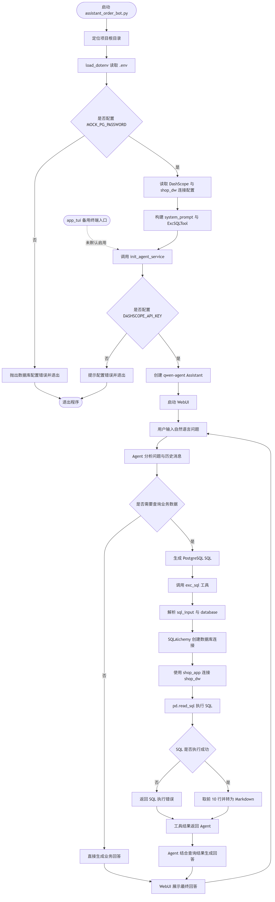

# a-simple-agent

一个面向数据仓库学习的本地 Text-to-SQL 订单助手项目。

项目将手机购物 App 的 mock 数仓、AI Agent、向量库、Agent 记忆和操作日志整合在同一套 PostgreSQL 环境中，并通过 DashScope + qwen-agent 查询 `shop_dw` 数据。

## 1. 项目组成

| 模块 | 说明 |
| --- | --- |
| `app/assistant_order_bot.py` | 旧版订单助手，使用 qwen-agent + Text-to-SQL 查询业务数仓 |
| `app/governance/` | v2 治理版 FastAPI、SQL 校验、只读执行、脱敏、语义层、记忆、审计与评测 |
| `shop_dw` | 手机购物 App 星型数仓，9 张维度表 + 7 张事实表 |
| `embedding_store` | 文档分块与 pgvector 向量数据 |
| `agent_memory` | Agent 会话、消息与长期记忆 |
| `op_log` | 应用操作日志 |
| `spec/` | 数据库、安装、隔离、数据模型设计文档 |
| `test/` | 初始化环境与数据场景验收测试 |

`shop_dw` 当前包含约 2.3 万订单，覆盖 2025-01-01 至脚本运行当日的上海时区日期，包含全国地区、日常类目、大促、共享地址、共享手机号和多商家经营等模拟场景。

## Agent 流程图



源文件：[Mermaid](docs/agent_flow.mmd) / [SVG](docs/agent_flow.svg)

## 2. 文档导航

| 文档 | 说明 |
| --- | --- |
| `spec/architecture.md` | 总体架构与初始化流程 |
| `spec/environment.md` | PostgreSQL 下载、安装、pgvector 与初始化 |
| `spec/isolation_and_security.md` | 四库隔离与权限设计 |
| `spec/data_model_shop_dw.md` | 业务数仓 16 表模型与 mock 场景 |
| `spec/data_model_embedding_store.md` | 文档与向量表 |
| `spec/data_model_agent_memory.md` | Agent 会话与记忆表 |
| `spec/data_model_operation_log.md` | 操作日志表 |
| `spec/agent_app.md` | 订单助手应用设计与安全边界 |
| `spec/governance.md` | v2 治理链路、权限、语义层、审计与评测设计 |
| `docs/getting_started.md` | 零基础安装与启动 |
| `docs/concept_map.md` | 数仓与 Agent 概念地图 |
| `docs/demo.md` | 演示问题、SQL 和预期结果 |
| `docs/operations.md` | 启停、查询、重置操作 |
| `docs/troubleshooting.md` | 常见错误与修复 |
| `docs/upgrade_plan.md` | v2 升级版改进计划 |
| `SECURITY.md` | 密码与数据安全说明 |
| `docs/environment_requirements.md` | 系统、Python、PostgreSQL 与网络要求 |
| `test/test_plan.md` | 验收测试说明 |

## 3. 环境准备

详细要求见 `docs/environment_requirements.md`。

### 3.1 PostgreSQL 与 pgvector

```powershell
Copy-Item .env.example .env
# 编辑 .env，填写 PostgreSQL 与 DashScope 配置

powershell -ExecutionPolicy Bypass -File .\spec\scripts\download_dependencies.ps1
powershell -ExecutionPolicy Bypass -File .\spec\scripts\install_postgresql.ps1
powershell -ExecutionPolicy Bypass -File .\spec\scripts\init_all.ps1
```

### 3.2 Python 环境

推荐 Python 3.13。

```powershell
python -m venv .venv
.\.venv\Scripts\Activate.ps1
pip install -r .\requirements.txt
```

### 3.3 `.env` 配置

`.env` 已被 `.gitignore` 忽略，不会随源码分享。

```dotenv
MOCK_PG_SUPER_PASSWORD=你的 postgres 超级用户密码
MOCK_PG_APP_PASSWORD=你的应用角色密码

MOCK_PG_HOST=localhost
MOCK_PG_PORT=5432
MOCK_PG_USER=shop_app
MOCK_PG_PASSWORD=你的 shop_app 密码
MOCK_PG_DB=shop_dw

DASHSCOPE_API_KEY=你的 DashScope API Key
```

## 4. 启动订单助手

```powershell
.\.venv\Scripts\Activate.ps1
python .\app\assistant_order_bot.py
```

默认启动 qwen-agent WebUI。Agent 会根据用户问题生成 SQL，通过 `exc_sql` 工具查询 `shop_dw`，然后返回自然语言分析结果。

示例问题：

- 2025 年 11 月各品类的订单金额排名情况。
- 2025 年 618 期间各渠道的订单量和支付金额统计。
- 2026 年 1-8 月每月的退款金额和退款率趋势。
- 哪些省份的订单量最高。
- 哪些商家和类目在双11期间表现最好。

## 5. 验收测试

```powershell
powershell -ExecutionPolicy Bypass -File .\test\scripts\run_all.ps1
```

测试覆盖环境、四库隔离、16 张业务表结构、mock 数据场景、截至今日的订单与退款趋势、向量检索、Agent 记忆和操作日志。

## 6. 目录结构

```text
a-simple-agent/
|-- .env.example
|-- .gitignore
|-- README.md
|-- SECURITY.md
|-- LICENSE
|-- requirements.txt
|-- app/
|   |-- assistant_order_bot.py   旧版 qwen-agent WebUI 入口
|   `-- governance/              v2 治理版 Agent、API 与评测模块
|-- docs/
|   |-- agent_flow.mmd
|   |-- agent_flow.svg
|   |-- agent_flow.png
|   |-- getting_started.md
|   |-- environment_requirements.md
|   |-- concept_map.md
|   |-- demo.md
|   |-- operations.md
|   `-- troubleshooting.md
|-- Dockerfile
|-- docker-compose.yml
|-- docker/                  容器初始化脚本
|-- scripts/
|   |-- check_environment.ps1
|   |-- start_agent.ps1
|   |-- start_governed_api.ps1
|   |-- start_governed_webui.ps1
|   |-- sync_governance_semantic.ps1
|   `-- reset_mock_data.ps1
|-- downloads/              外部安装包，已忽略
|-- spec/
|   |-- architecture.md
|   |-- governance.md
|   |-- environment.md
|   |-- isolation_and_security.md
|   |-- data_model_*.md
|   |-- ddl/                角色、业务 DDL、治理 DDL 与 mock 种子 SQL
|   `-- scripts/            下载、安装、初始化脚本
`-- test/
    |-- test_plan.md
    |-- scripts/run_all.ps1
    `-- sql/                分库验收 SQL
```

## 7. 分享注意事项

- `.env` 包含数据库密码和 DashScope Key，禁止提交。
- `downloads/` 包含大型安装包，已被忽略，分享前可删除。
- 接收方通过 `.env.example` 创建自己的 `.env`。
- `extract_resume.py`、`resume_text.txt` 和个人简历 PDF 是本地个人材料，已被忽略，禁止分享或提交。
- `shop_dw` 的 mock 数据由 `spec/ddl/` 下的 SQL 生成，不依赖本地数据库文件。

## 8. v2 数据问答与治理系统

v2 在保留旧版 WebUI 的同时，新增受治理的 FastAPI 服务：

| 能力 | 说明 |
| --- | --- |
| SQL 校验 | SQLGlot 只读白名单、单语句、表/函数/敏感字段拦截 |
| 只读执行 | `shop_ro` 角色、只读事务、3000ms 超时、最多 100 行 |
| 权限与脱敏 | 数据库字段级权限 + `v_fact_order_item_masked` + 应用层二次脱敏 |
| 语义层 | `embedding_store.governance` 表、字段、指标、SQL 示例与 pgvector 检索 |
| 记忆与审计 | `agent_memory` 会话消息 + `op_log` append-only 审计 |
| 评测 | 50 条 Text-to-SQL 案例与 `op_log.eval` 结果表 |
| 服务化 | FastAPI `/api/v1/query`、`/healthz` |
| 部署 | `docker-compose.yml` 提供 PostgreSQL 18 + pgvector、语义向量同步与 API 服务 |

详细设计见 `spec/governance.md`。

### 8.1 初始化与启动

```powershell
powershell -ExecutionPolicy Bypass -File .\spec\scripts\init_all.ps1
powershell -ExecutionPolicy Bypass -File .\scripts\sync_governance_semantic.ps1
powershell -ExecutionPolicy Bypass -File .\scripts\start_governed_api.ps1
```

Docker 启动：

```powershell
docker compose up --build
```

Docker 会先完成数据库初始化，再执行 `semantic-sync` 生成语义向量，最后启动 API；数据库宿主机端口为 5433，API 端口为 8000。

### 8.2 API 调用

```powershell
$headers = @{ 'X-API-Key' = '你的 APP_API_KEY' }
$body = @{ question = '2025年11月各品类的订单金额排名情况' } | ConvertTo-Json
Invoke-RestMethod -Method Post -Uri 'http://127.0.0.1:8000/api/v1/query' -Headers $headers -ContentType 'application/json' -Body $body
```

健康检查：

```powershell
Invoke-RestMethod -Uri 'http://127.0.0.1:8000/healthz'
```

### 8.3 评测

```powershell
python -m app.governance.eval_runner
```

评测结果写入 `op_log.eval.eval_runs` 与 `op_log.eval.eval_case_results`。完整评测集为 50 条，其中 47 条正常查询、3 条安全拒绝案例；SQL 可执行率和结果正确率只按正常查询统计，安全拒绝单独统计。
